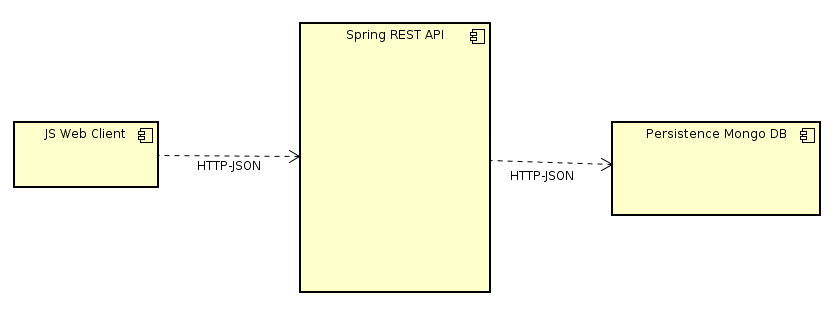

# UNITE

### Desarrolladores

- Sergio Andrés Rodríguez Torres
- Nicolás García Rey
- Juan Dueñas Rivera

## Descripción de la arquitectura

Consta de un cliente pesado en JavaScript el cual genera de forma dinámica el contenido de la página. La página provee servicios colaborativos en tiempo real
para la elaboración de eventos y fiestas, cada usuario puede crear su propia cuenta y comunicarse con los demás usuarios.
Se realiza la comunicación entre el cliente web y el servidor en java mediante RestAPI en mensajes JSON de forma asíncrona,
la aplicación cuenta con persistencia de la información, la cual se implementa mediante una base de datos no-SQL Mongo BD.
La cominicación del contenido del evento se realiza en tiempo real, mediante un STOMP a través de un Message Broker, se crean varios topicos para la cominicacion de 
mensajes para el chat, la cominicación de enlaces de interes y las recolectas.

El proyecto esta montado sobre Spring boot el cual provee servicios de restAPI en /unite y integra varios componentes como la base de datos MongoDB y el Message Broker. 

Se implementa seguridad mediante JWT que hace validacion de todas las peticiones al servidor.

## [Heroku link](https://unite-project.herokuapp.com)